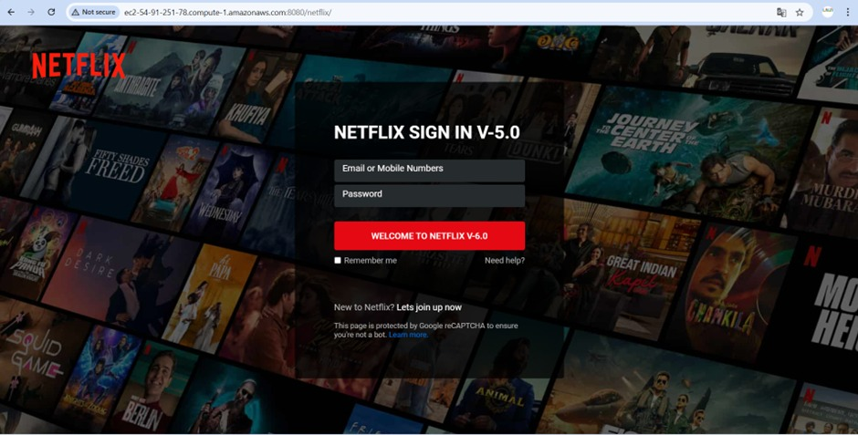

# DEPLOY AN NETFLIX APPLICATION IN TOMCAT SERVER USING CI/CD

This project demonstrates the deployment of a Netflix-like application using a Continuous Integration and Continuous Deployment (CI/CD) pipeline. The deployment process involves multiple technologies such as HCP (HashiCorp Cloud Platform), Jenkins, Maven, Nexus, Tomcat, and Grafana. The following README explains the theory behind the deployment and the essential commands used to deploy the application.

## Project Overview

The goal of this project is to deploy a Netflix-like application on a Tomcat server using a CI/CD pipeline that is automated with Jenkins. We use the following tools to manage the deployment:

- **Git**: For version control and source code management.
- **HCP**: For managing and provisioning cloud infrastructure.
- **Jenkins**: For automating the build, test, and deployment processes.
- **Maven**: To build and package the application.
- **Nexus**: To store the artifacts created during the build process.
- **Tomcat**: The web server used to deploy the application.
- **Grafana & Prometheus**: For monitoring and visualizing system metrics.

## Prerequisites

Before starting with the deployment process, make sure you have the following:

- A **GitHub** account with the source code repository.
- An **HCP** account for provisioning cloud infrastructure.
- Installed tools: **Terraform**, **Maven**, **Jenkins**, **Tomcat**, **Nexus**, **Grafana**, and **Prometheus**.
- Access to the servers where Jenkins, Tomcat, Nexus, and Grafana are running.

## Steps for Deployment

### Step 1: Provision Infrastructure with HCP

- **Create an HCP account** and log in to manage cloud resources.
- **Create a GitHub repository** to store your code.
- **Write Terraform code** to provision the necessary cloud resources on HCP. This includes setting up servers and integrating them with your version control system (GitHub).
  
**Commands:**
```bash
terraform init
terraform plan
terraform apply

```
### Step 2: Configure Servers (Jenkins, Tomcat, Nexus, Grafana)
1. Jenkins : vim jenkins.sh --> sh jenkins.sh
2. Tomcat  : vim tomcat.sh --> sh tomcat.sh
3. Nexus   : vim nexus.sh --> sh nexus.sh
4. Grafana : vim grafana.sh --> sh grafana.sh

### Step 3: Create a Repository in Nexus
1. Log into the Nexus Repository Manager via your browser.
2. Create a Maven repository in Nexus to host your built WAR files.

**Commands in Nexus UI:**
```
Go to Repository Settings → Repositories → Create Repository.
Choose maven2 (hosted) as the repository type.
Configure the repository (public or private access).
Save the repository settings.

```
### Step 4: Build and Deploy the Application using Jenkins

In Jenkins, create a pipeline job that automates the process of building, testing, and deploying the application. The Jenkins pipeline will follow these stages:

1. Checkout: Retrieve the latest code from GitHub.
2. Build: Use Maven to compile the source code.
3. Test: Run unit tests using Maven.
4. Artifact: Package the application as a WAR file using Maven.
5. Nexus: Upload the artifact to the Nexus repository.
6. Deploy: Deploy the WAR file to the Tomcat server.

### Step 5: Deploy the Application to Tomcat
To deploy the WAR file to Tomcat:

Access the Tomcat Manager through the browser at http://<public-ip>:8080/manager/html.
Use the Tomcat Manager interface to deploy the WAR file.

**Tomcat Manager Commands:**

```
Go to Manager App → Deploy → Select the WAR file from the Nexus repository → Deploy.
```
### Step 6: Monitor the Application with Prometheus and Grafana
To monitor the application:

1. Install and configure Prometheus to collect metrics from the Tomcat server.
2. Install and configure Grafana to visualize the data collected by Prometheus.
3. Add Prometheus as a data source in Grafana.
4. Import the predefined Prometheus dashboard (ID: 1860) to visualize system performance.

**Grafana Setup:**
```
--> In Grafana, go to Data Sources → Add Data Source → Prometheus.
--> Set the Prometheus URL and click Save & Test.
--> At the top of the page, click the + symbol → Import Dashboard.
--> Import the Prometheus Dashboard ID 1860 for monitoring.
```

### OUTPUT:


